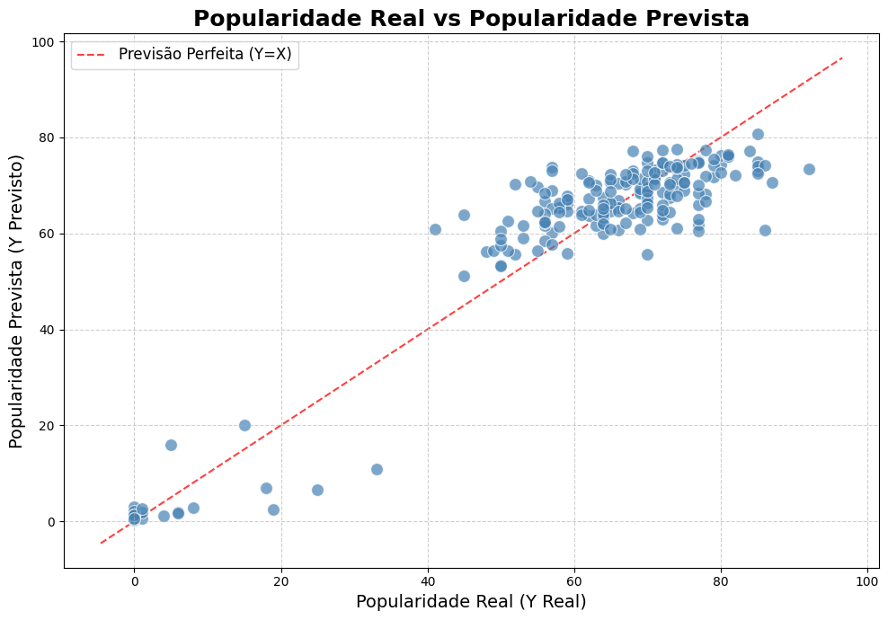
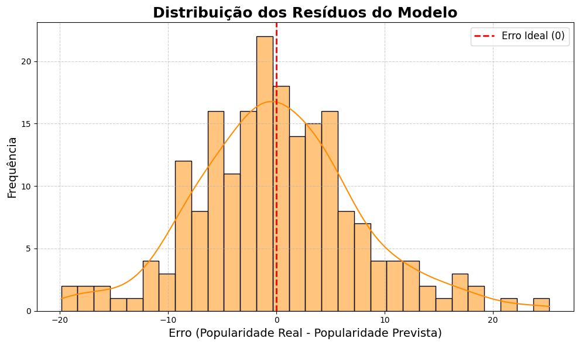

# Desvendando-o-Proximo-Hit:Análise de Dados e Previsão de Popularidade no Spotify.
Desvendando o Próximo Hit: Análise de Dados e Previsão de Popularidade no Spotify.

No dinâmico e implacável cenário da indústria musical, a pergunta que ecoa nos corredores das gravadoras, nos estúdios de artistas e nas sedes das plataformas de streaming é sempre a mesma: qual será o próximo hit? Identificar aquela melodia, aquele ritmo, que vai cativar milhões e dominar as paradas é o sonho e, ao mesmo tempo, o maior desafio. Artistas investem paixão e talento, gravadoras apostam fortunas, e plataformas como o Spotify buscam desesperadamente a faixa que definirá a próxima era. A capacidade de prever o sucesso de uma música antes mesmo de seu lançamento não é apenas uma vantagem competitiva; é a chave para otimizar estratégias, direcionar investimentos com sabedoria e garantir que a canção perfeita encontre seu caminho até o público.

Foi com essa visão que demos vida ao nosso projeto: "Desvendando o Próximo Hit". Nosso objetivo? Ir além da superficialidade dos números, mergulhando na vastidão de dados do Spotify para construir uma ferramenta preditiva que transformasse a intuição em um conhecimento acionável. A promessa era clara: decifrar o código da popularidade e prever qual melodia está destinada a se tornar a próxima grande sensação.
Orquestrando Dados, Harmonizando Padrões.

Para desvendar esse enigma musical, a jornada começou com uma imersão profunda no universo de dados do Spotify. Coletamos um dataset robusto, mas bruto, que continha as identidades dos artistas – seus nomes, gêneros e o impressionante número de seguidores – e os perfis intrínsecos de milhões de músicas: títulos, álbuns, datas de lançamento e, crucialmente, suas características sonoras objetivas. Falamos de "dançabilidade" (o quão fácil é dançar com a música), "energia" (a intensidade da faixa), "valência" (a positividade musical), "loudness" e muitas outras métricas acústicas que, juntas, pintam um retrato sonoro de cada canção.

Colunas foram renomeadas para clareza, datas foram padronizadas e, em um passo fundamental, os diversos gêneros musicais foram transformados em mais de cem categorias binárias através do One-Hot Encoding – uma técnica que permitiu ao nosso modelo compreender e quantificar a influência de cada estilo. Extraímos novas features valiosas, como o "ano de lançamento" e a duração precisa das músicas em segundos e minutos, enriquecendo ainda mais nossa base de conhecimento. No final desse processo de refinamento, nosso dataset inicial de 23 colunas havia florescido em uma rica matriz de 180 colunas, cada uma uma peça vital na complexa engrenagem da previsão.

Treinamos um modelo de Machine Learning que aprendeu os padrões complexos entre as características das músicas e sua popularidade. Os resultados foram altamente promissores:

Erro Absoluto Médio (MAE): 5.76 (nossas previsões erraram, em média, por apenas ~5.76 pontos).

Raiz do Erro Quadrático Médio (RMSE): 7.54.

Coeficiente de Determinação (R²): 0.88, indicando que 88% da variação na popularidade das músicas pode ser explicada pelo nosso modelo. Isso demonstra a alta precisão e a capacidade do modelo de compreender o que impulsiona o sucesso.

**GRÁFICO DE PREVISÃO DO MODELO**

 Além dos números e das métricas, a verdadeira beleza de um modelo preditivo reside em sua capacidade de visualizar a precisão. É aqui que a teoria encontra a prática, e a complexidade dos algoritmos se traduz em uma imagem clara e intuitiva do desempenho do nosso sistema.

Nosso gráfico de dispersão, intitulado "Popularidade Real vs Popularidade Prevista", serve como o espelho onde o nosso modelo reflete a realidade do sucesso musical no Spotify.
O que o gráfico nos revela:

A Linha da Perfeição (Vermelha Pontilhada): A linha diagonal vermelha, rotulada como "Previsão Perfeita (Y=X)", representa o cenário ideal. Se cada ponto de popularidade prevista fosse exatamente igual à popularidade real, todos os nossos dados estariam sobre essa linha. Ela é nosso benchmark, o alvo que o modelo busca atingir.

Os Pontos Azuis (Músicas Reais vs. Previsões do Modelo): Cada ponto azul no gráfico representa uma música do nosso conjunto de dados de teste (músicas que o modelo nunca viu durante o treinamento).
Ao observar a concentração dos pontos azuis, percebemos que eles se agrupam notavelmente próximos à linha vermelha pontilhada. Essa proximidade visual é a confirmação gráfica da alta precisão do nosso modelo:
Valores Baixos de Popularidade: Observamos que para músicas com popularidade real muito baixa (próximo de 0), o modelo também previu valores muito baixos, mostrando que ele não superestima canções impopulares.

Valores de Popularidade Média a Alta: Para a vasta maioria das músicas, especialmente aquelas com popularidade real entre 50 e 90, os pontos estão densamente agrupados perto da linha de previsão perfeita. Isso indica que, para as músicas que mais importam para a indústria (as que têm potencial de sucesso), nosso modelo é consistentemente acurado.

Este gráfico não só valida numericamente a eficácia do nosso modelo, mas também oferece uma compreensão instantânea e visual de sua performance. Ele nos assegura que, ao prever a popularidade de uma nova música em 67.62 (como visto no gráfico anterior), nosso modelo está fazendo uma estimativa realista e alinhada com os padrões de sucesso já observados no vasto universo musical do Spotify

**GRÁFICO DE DISTRIBUIÇÃO DE RESIDOS**

Nosso gráfico, "Distribuição dos Resíduos do Modelo", é um histograma que nos permite mergulhar nas diferenças entre o que o modelo previu e o que realmente aconteceu.

O que o gráfico dos resíduos nos revela:

O Eixo X: O Erro em Si: O eixo horizontal representa o "Erro (Popularidade Real - Popularidade Prevista)".

Um erro próximo de 0 (zero) significa que a previsão do modelo foi quase perfeita para aquela música.

Um erro positivo (ex: +5) indica que a popularidade real foi maior do que a prevista (o modelo subestimou a música).

Um erro negativo (ex: -5) indica que a popularidade real foi menor do que a prevista (o modelo superestimou a música).

A Linha do Erro Ideal (Vermelha Pontilhada): A linha vertical vermelha em zero (Erro Ideal (0)) é o nosso alvo. Queremos que a maioria dos erros se concentre o mais próximo possível dela.

A Distribuição dos Erros (Histograma Laranja e Curva):

Percebemos uma distribuição dos erros que se assemelha muito a uma curva normal (formato de sino), centralizada de forma notável perto do zero. Isso é um sinal excelente!

A maior concentração das barras do histograma está entre -5 e +5, e entre -10 e +10, mostrando que a maioria dos erros é pequena. Isso se alinha perfeitamente com o nosso MAE de 5.76, confirmando que a diferença média é realmente baixa.

A simetria em torno do zero indica que o modelo não está sistematicamente superestimando ou subestimando a popularidade. Os erros se distribuem de forma balanceada, o que é um comportamento desejável.
Este "afinador" nos mostra que o nosso modelo não só toca a melodia do sucesso com maestria, mas que cada nota de sua previsão está afinada com precisão, garantindo que os erros sejam mínimos, aleatórios e, portanto, aceitáveis. É a prova final da robustez e da confiabilidade do nosso sistema de previsão de hits.

**GRAFICO FINAL, OBJETIVO DO PROJETO**

Nosso gráfico, "Distribuição da Popularidade das Músicas do Spotify com Previsão da nova Música", é o ponto culminante do nosso esforço, cumprindo diretamente o objetivo do projeto ao posicionar visualmente o potencial de um novo lançamento.
O Que o Gráfico nos Mostra:

A Realidade do Mercado Musical (Histograma Azul Claro): O histograma em azul-claro representa a distribuição da popularidade de milhões de músicas do nosso dataset original do Spotify. Ele nos conta uma história fascinante:

Vemos um grande pico próximo de zero, indicando que a vasta maioria das músicas no Spotify tem baixa popularidade (seja por serem novas, nichadas ou simplesmente não "decolaram").

No entanto, há um segundo pico, maior e mais denso, centrado na faixa de popularidade média a alta (entre 60 e 80). É aqui que residem as músicas que verdadeiramente "estouraram" ou alcançaram um sucesso significativo. Essa distribuição bimodal reflete a dinâmica real e desafiadora do mercado: muitas músicas lançadas, poucas que se tornam um sucesso.

O Próximo Hit em Destaque (Linha Vermelha Pontilhada): A linha vertical vermelha pontilhada é a estrela do nosso show. Ela marca a Popularidade Prevista: 67.62 para uma nova música, uma faixa que nunca foi vista pelo nosso modelo durante o treinamento.
ste gráfico cumpre o objetivo do projeto:

Validação da Capacidade Preditiva: A localização da linha de previsão (67.62) é a prova visual mais forte da eficácia do nosso modelo. Em vez de prever um valor aleatório ou cair no pico de músicas impopulares, o modelo conseguiu "mirar" e posicionar a nova música firmemente no coração da faixa de popularidade onde os hits de verdade residem. Isso demonstra que o modelo não só compreende os padrões de popularidade, mas também consegue aplicá-los com sucesso a dados completamente novos.

Contexto Estratégico Imediato: Para um artista, um produtor ou um executivo de gravadora, esse gráfico é uma ferramenta de decisão instantânea. Uma previsão de 67.62, visualizada dentro do cluster de músicas bem-sucedidas, oferece uma base sólida para:

Alocação de Investimentos: Justifica o direcionamento de recursos significativos para marketing e promoção.

Definição de Expectativas: Ajuda a estabelecer expectativas realistas, mas otimistas, sobre o alcance potencial da música.

Estratégias de Lançamento: Informa sobre o potencial de inclusão em playlists de alto impacto ou colaborações.

Compreensão da Dinâmica de Sucesso: O gráfico reforça nossa compreensão da complexa dinâmica do Spotify. Nosso modelo não apenas previu um número, mas previu um número que faz sentido dentro do comportamento de popularidade observado, distinguindo músicas com potencial de hit da vasta maioria de músicas de baixo impacto.

